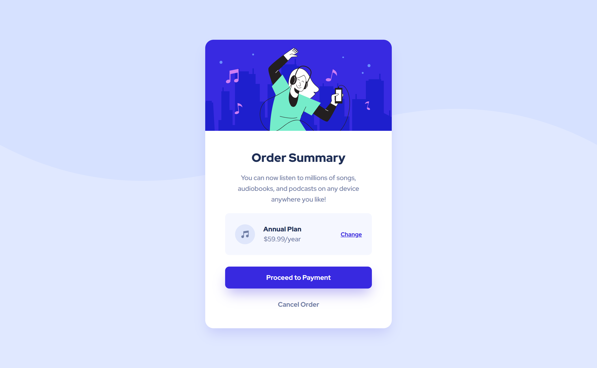
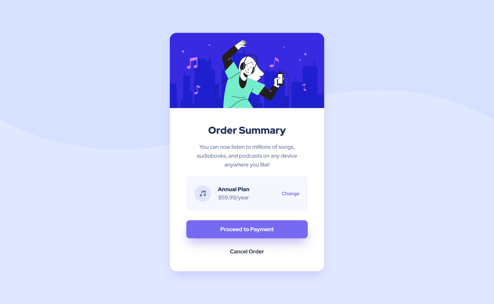

# Frontend Mentor - Order summary card solution

This is a solution to the [Order summary card challenge on Frontend Mentor](https://www.frontendmentor.io/challenges/order-summary-component-QlPmajDUj). Frontend Mentor challenges help you improve your coding skills by building realistic projects. 

## Table of contents

- [Overview](#overview)
  - [The challenge](#the-challenge)
  - [Screenshot](#screenshot)
  - [Links](#links)
- [My process](#my-process)
  - [Built with](#built-with)
- [Author](#author)

## Overview

### The challenge

Users should be able to:

- See hover states for interactive elements

### Screenshot

##### Desktop design

##### Active states design

##### Mobile design

### Links

- Solution URL: [https://github.com/doomware/order-summary](https://github.com/doomware/order-summary)
- Live Site URL: [https://doomware.github.io/order-summary/](https://doomware.github.io/order-summary/)

## My process

### Built with

- CSS custom properties
- Flexbox
- Mobile-first workflow

## Author

- Frontend Mentor - [@doomware](https://www.frontendmentor.io/profile/doomware)
- Twitter - [@d00mwar3](https://twitter.com/d00mwar3)